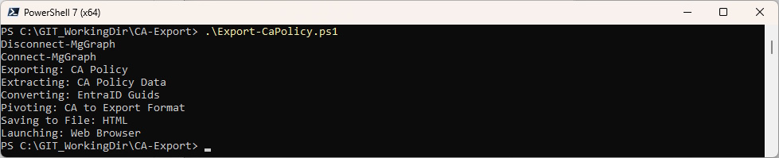
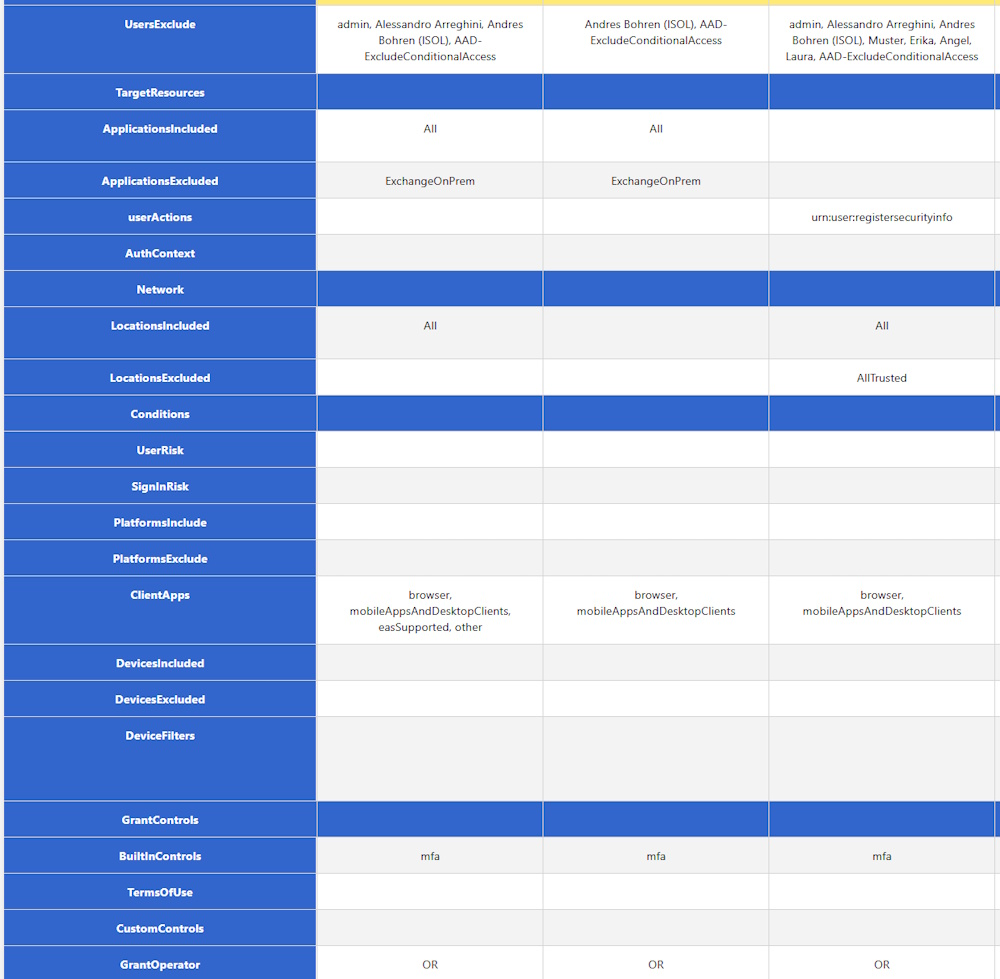

# CA-Export
PowerShell Script to help Export your CA policys as a html format. 

If not already connected the Script will connect Microsoft.Graph and use the Scopes documented below

```posh
Connect-MgGraph -Scopes 'Policy.Read.All', 'Directory.Read.All','Application.Read.All' -NoWelcome
```

To run the Script use this Command

```posh
.\Export-CaPolicy.MSGraph.ps1
```





## History
13.02.2023 Fixed:
- Test Module and Connect-MgGraph
- Addet Session Controls
- Output is now devided into Conditions, SessionControls, GrantControls
- Code Cleanup and changed from Spaces to Tabs

15.02.2023 Fixed:
- Output is now devided into Users, Cloud Apps or Actions, Conditions, GrantControls, SessionControls (like in CA Portal)
- Minor rearrangement of Rows

18.04.2023 Fixed:
- Fixed Script Parameter "PolicyID" -ConditionalAccessPolicyId
- Addet PolicyID to HTML Output
	
03.05.2023 Fixed:
- Changed UPN to Displaynames for AD Objects because Groups don't have a UPN

04.06.2024 Fixed:
- Remove Select-MgProfile (older Microsoft.Graph Module)
- Fixed GrantControls

## License

Shield: [![CC BY-NC-SA 4.0][cc-by-nc-sa-shield]][cc-by-nc-sa]

This work is licensed under a
[Creative Commons Attribution-NonCommercial-ShareAlike 4.0 International License][cc-by-nc-sa].

[![CC BY-NC-SA 4.0][cc-by-nc-sa-image]][cc-by-nc-sa]

[cc-by-nc-sa]: http://creativecommons.org/licenses/by-nc-sa/4.0/
[cc-by-nc-sa-image]: https://licensebuttons.net/l/by-nc-sa/4.0/88x31.png
[cc-by-nc-sa-shield]: https://img.shields.io/badge/License-CC%20BY--NC--SA%204.0-lightgrey.svg
